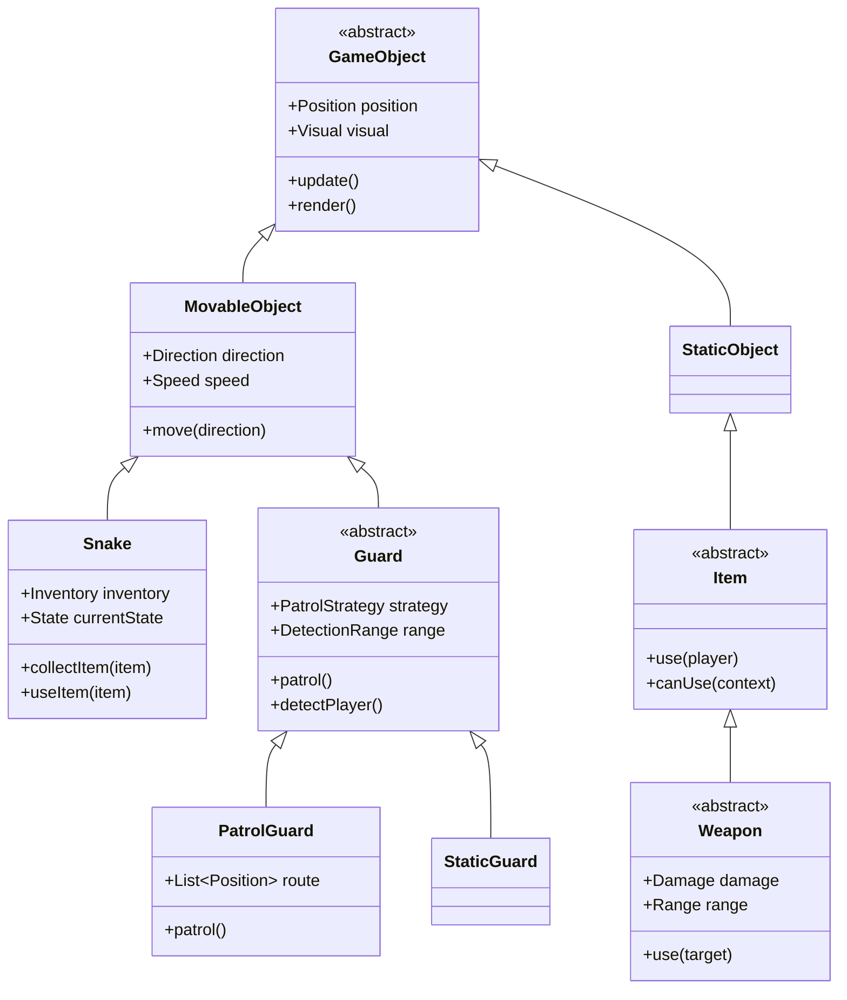

# Metal Gear NES - Documentación del Proyecto

## 📋 Información General

**Nombre del Proyecto:** Metal Gear NES Clone  
**Plataforma:** Wollok Games  
**Lenguaje:** Wollok  
**Tipo:** Juego de Sigilo 2D  
**Objetivo Académico:** Demostrar conceptos de POO (Polimorfismo, Herencia, Delegación)

---

## 🎯 Requerimientos Funcionales

### RF01 - Movimiento del Personaje Principal
- El jugador puede mover a Snake en 4 direcciones (arriba, abajo, izquierda, derecha)
- Snake debe respetar las colisiones con obstáculos
- Snake puede cambiar entre estados: Normal, Agachado, Escondido

### RF02 - Sistema de Guardias
- Diferentes tipos de guardias con comportamientos únicos
- Sistema de patrullaje automático
- Detección del jugador basada en línea de visión
- Sistema de alertas cuando detectan al jugador

### RF03 - Inventario y Objetos
- Snake puede recolectar y usar diferentes tipos de items
- Llaves para abrir puertas
- Armas con diferentes características
- Objetos especiales (caja de cartón para esconderse)

### RF04 - Interacciones del Entorno
- Puertas que requieren llaves específicas
- Contenedores que pueden ocultar items
- Obstáculos que bloquean el movimiento y la visión

### RF05 - Sistema de Game Over y Victoria
- Detección resulta en Game Over
- Objetivo: llegar a la salida sin ser detectado
- Sistema de niveles progresivos

---

## 🏗️ Arquitectura del Sistema

### Jerarquía Principal de Clases

```
GameObject (abstract)
├── Position
├── Visual representation
├── Collision detection
└── Update logic

MovableObject extends GameObject
├── Snake
└── Character (abstract)
    ├── Guard (abstract)
    │   ├── PatrolGuard
    │   ├── StaticGuard
    │   └── SentryGuard
    └── NPC (future extension)

StaticObject extends GameObject
├── Obstacle (abstract)
│   ├── Wall
│   ├── Door
│   └── Container
└── Item (abstract)
    ├── Key
    ├── Weapon (abstract)
    │   ├── Pistol
    │   └── Rifle
    └── SpecialItem (abstract)
        ├── CardboardBox
        └── HealthKit
```

---

## 🔄 Aplicación de Polimorfismo

### 1. Sistema de Guardias
```wollok
class Guard {
    method patrol() // Método polimórfico
    method detectPlayer(player)
    method onAlert()
}

class PatrolGuard inherits Guard {
    override method patrol() {
        // Movimiento en ruta predefinida
    }
}

class StaticGuard inherits Guard {
    override method patrol() {
        // Rotación en el lugar
    }
}
```

### 2. Sistema de Armas
```wollok
class Weapon {
    method use(target) // Método polimórfico
    method range()
    method damage()
}

class Pistol inherits Weapon {
    override method use(target) {
        // Lógica específica de pistola
    }
}
```

### 3. Sistema de Items
```wollok
class Item {
    method use(player) // Método polimórfico
    method canUse(context)
}
```

---

## 🎨 Patrones de Diseño Implementados

### 1. Strategy Pattern - Comportamiento de Guardias
```wollok
class Guard {
    var patrolStrategy
    
    method patrol() {
        patrolStrategy.execute(self)
    }
}

object linearPatrol {
    method execute(guard) { /* ... */ }
}

object circularPatrol {
    method execute(guard) { /* ... */ }
}
```

### 2. Observer Pattern - Sistema de Alertas
```wollok
object alertSystem {
    const observers = #{}
    
    method addObserver(observer) {
        observers.add(observer)
    }
    
    method notifyAlert(position) {
        observers.forEach({ observer => observer.onAlert(position) })
    }
}
```

### 3. State Pattern - Estados de Snake
```wollok
class Snake {
    var currentState = normalState
    
    method changeState(newState) {
        currentState = newState
    }
    
    method move(direction) {
        currentState.move(self, direction)
    }
}

object normalState {
    method move(snake, direction) { /* ... */ }
}

object hiddenState {
    method move(snake, direction) { /* ... */ }
}
```

---

## 🔧 Delegación de Responsabilidades

### GameManager
- Coordinación general del juego
- Manejo de estados globales (Playing, GameOver, Victory)
- Transiciones entre niveles

### CollisionManager
- Detección de colisiones entre objetos
- Validación de movimientos
- Interacciones objeto-objeto

### InventoryManager
- Gestión de items del jugador
- Lógica de uso de items
- Persistencia de inventario

### DetectionSystem
- Cálculo de líneas de visión
- Lógica de detección de guardias
- Manejo de alertas

### LevelLoader
- Carga de configuración de niveles
- Posicionamiento inicial de objetos
- Definición de objetivos por nivel

---

## 📊 Diagrama de Clases Principal



---

## 🗂️ Estructura del Proyecto

```
metal-gear-nes/
├── src/
│   ├── characters/
│   │   ├── snake.wlk
│   │   └── guards/
│   │       ├── guard.wlk
│   │       ├── patrol_guard.wlk
│   │       └── static_guard.wlk
│   ├── items/
│   │   ├── item.wlk
│   │   ├── weapons/
│   │   └── consumables/
│   ├── obstacles/
│   │   ├── wall.wlk
│   │   └── door.wlk
│   ├── systems/
│   │   ├── game_manager.wlk
│   │   ├── collision_manager.wlk
│   │   └── detection_system.wlk
│   └── game.wpgm
├── assets/
│   ├── sprites/
│   └── sounds/
├── levels/
│   ├── level1.wlk
│   └── level2.wlk
├── tests/
└── docs/
    ├── architecture.md
    └── user_manual.md
```
